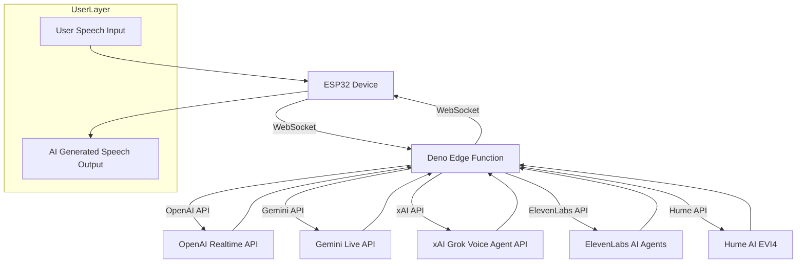
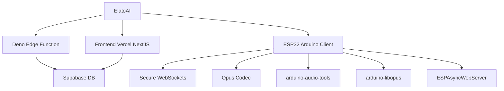

  <a href="https://elatoai.com"><picture>
    <source media="(prefers-color-scheme: dark)" srcset="assets/darkelato.png">
    <source media="(prefers-color-scheme: light)" srcset="assets/lightelato.png">
    
  </picture></a>
  

    
  
  
<!--  -->
      
 <!--  -->

 

<!-- 

    
      
 
    

 -->

 

# 👾 ElatoAI: Realtime Voice AI Models on Arduino ESP32

Realtime AI Speech powered by SoTA AI voice models on ESP32, with Secure WebSockets & Deno Edge Functions for >15-minute uninterrupted conversations globally. We currently support OpenAI Realtime API, Gemini Live API, xAI Grok Voice Agents API, Eleven Labs Conversational AI Agents, and Hume AI EVI-4.

- [🚀 Quick Start](https://www.elatoai.com/docs/quickstart)
- [Build with PlatformIO](https://www.elatoai.com/docs/platformio)
- [Build on Arduino IDE](https://www.elatoai.com/docs/arduino)
- [Deploy globally](https://www.elatoai.com/docs/blog/deploying-globally)
- [🤖🤖🤖 Deploy multiple devices](https://www.elatoai.com/docs/blog/multiple-devices)

## 📽️ Demo Video

    

Video links: [OpenAI Demo](https://youtu.be/o1eIAwVll5I) | [Gemini Demo](https://youtu.be/_zUBue3pfVI) | [Eleven Labs Demo](https://youtu.be/7LKTIuEW-hg) | [Hume AI EVI-4 Demo](https://youtu.be/Gtann5pdV0I)

## 👷‍♀️ DIY Hardware Design

## 📱 App Design

Control your ESP32 AI device from your phone with the ElatoAI webapp.

## ⭐️ Key Voice AI Features

## 🌟 Full feature list

1. **Realtime Speech-to-Speech**: Instant speech conversion powered by OpenAI's Realtime API, Gemini's Live API, xAI's Grok Voice Agent API, Eleven Labs Conversational AI Agents and Hume AI EVI4.
2. **Create Custom AI Agents**: Create custom agents with different personalities and voices.
3. **Customizable Voices**: Choose from a variety of voices and personalities.
4. **Secure WebSockets**: Reliable, encrypted WebSocket communication.
5. **Server VAD Turn Detection**: Intelligent conversation flow handling for smooth interactions.
6. **Opus Audio Compression**: High-quality audio streaming with minimal bandwidth.
7. **Global Edge Performance**: Low latency Deno Edge Functions ensuring seamless global conversations.
8. **ESP32 Arduino Framework**: Optimized and easy-to-use hardware integration.
9. **Conversation History**: View your conversation history.
10. **Device Management and Authentication**: Register and manage your devices.
11. **User Authentication**: Secure user authentication and authorization.
12. **Conversations with WebRTC and Websockets**: Talk to your AI with WebRTC on the NextJS webapp and with websockets on the ESP32.
13. **Volume Control**: Control the volume of the ESP32 speaker from the NextJS webapp.
14. **Realtime Transcripts**: The realtime transcripts of your conversations are stored in the Supabase DB.
15. **OTA Updates**: Over the Air Updates for the ESP32 firmware.
16. **Wifi Management with captive portal**: Connect to your Wifi network or Hotspot from the ESP32 device.
17. **Factory Reset**: Factory reset the ESP32 device from the NextJS webapp.
18. **Button and Touch Support**: Use the button OR touch sensor to control the ESP32 device.
19. **No PSRAM Required**: The ESP32 device does not require PSRAM to run the speech to speech AI.
20. **OAuth for Web client**: OAuth for your users to manage their AI characters and devices.
21. **Pitch Factor**: Control the pitch of the AI's voice from the NextJS webapp to create cartoon-like voices.
22. **Tool calling**: Call tools and functions from the ESP32 device to the Deno Edge Functions for a complete voice AI agent.
23. **Tap to turn on**: Tap the touchpad to turn it on from sleep.

## Project Architecture

ElatoAI consists of three main components:

1. **Frontend Client** (`Next.js` hosted on Vercel) - to create and talk to your AI agents and 'send' it to your ESP32 device
2. **Edge Server Functions** (`Deno` running on Deno/Supabase Edge) - to handle the websocket connections from the ESP32 device and the LLM Provider API calls
3. **ESP32 IoT Client** (`PlatformIO/Arduino`) - to receive the websocket connections from the Edge Server Functions and send audio to the LLM Provider via the Deno edge server.

## 🛠 Tech Stack

| Component       | Technology Used                          |
|-----------------|------------------------------------------|
| Frontend        | Next.js, Vercel            |
| Backend         | Supabase DB  |
| Edge Functions  | Deno Edge Functions on Deno/Supabase          |
| IoT Client      | PlatformIO, Arduino Framework, ESP32-S3  |
| Audio Codec     | Opus                                     |
| Communication   | Secure WebSockets                        |
| Libraries       | [ArduinoJson](https://github.com/bblanchon/ArduinoJson), [WebSockets](https://github.com/Links2004/arduinoWebSockets), [AsyncWebServer](https://github.com/ESP32Async/ESPAsyncWebServer), [ESP32_Button](https://github.com/esp-arduino-libs/ESP32_Button), [Arduino Audio Tools](https://github.com/pschatzmann/arduino-audio-tools), [ArduinoLibOpus](https://github.com/pschatzmann/arduino-libopus)        |

## High-Level Flowchart

## Project Structure

## 📊 Important Stats

- **Latency**: <2s round-trip globally
- **Audio Quality**: Opus codec at 12kbps (high clarity) 24kHz sampling rate
- **Uninterrupted Conversations**: Up to 15 minutes continuous conversations globally
- **Global Availability**: Optimized with edge computing

## 🛡 Security

- Secure WebSockets (WSS) for encrypted data transfers
- Optional: API Key encryption with 256-bit AES
- Supabase DB for secure authentication
- Postgres RLS for all tables

## 🚫 Limitations
- 3-4s Cold start time while connecting to edge server
- Tested with up to 17 minutes of uninterrupted conversations
- Edge server stops when wall clock time is exceeded
- No speech interruption detection on ESP32

## 🙌 Contributing

We value your contributions! Here are some ideas:
1. Speech Interruption on ESP32
2. ~~Adding Arduino IDE support~~
3. ~~Add Hume API client for emotion detection~~
4. Add MCP support on Deno Edge
5. ~~Plug in Eleven Labs API for voice generation~~
6. Add Azure OpenAI Support (easy pickens) - in review
7. Add Cartesia Support
8. Add Amazon Nova Support
9. Add Deepgram

## License

This project is licensed under the MIT License - see the [LICENSE](LICENSE) file for details.

**Check out our hardware offerings at [ElatoAI Products](https://www.elatoai.com/). If you find this project interesting or useful, support us by starring this project on GitHub. ⭐**
